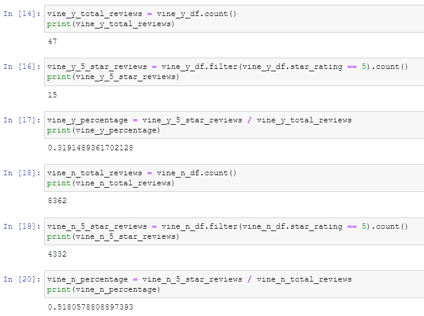

# Amazon_Vine_Analysis
## Overview of the analysis

This analysis on Amazon reviews aims to evaluate whether paid reviews, so called Vine reviews, are biased. In particular, reviews for watches sold in the US are analyzed for this evaluation.

## Results

Analysis has been carried out using PySpark. Reviews were filtered for the following criteria before comparing the Vine and non-Vine reivews.

- The number of total votes is greater than or equal to 20.
- The percentage of helpful votes over total votes is greater than or equal to 50%.

The comparisons are displayed in the following figure.

To summarize:

- There are **47** Vine reviews and **8,362** non-Vine reviews in total.

- There are **15** Vine reviews and **4,332** non-Vine reviews that are 5 stars.

- Among Vine reviews, **32%** percent are 5 stars. The percentage of 5-star reviews is **52%** among non-Vine reviews.

## Summary

Based on the above results, the Vine reviews do not show positivity bias comparing to the non-Vine reviews. On the contrary, the Vine reviews show less positivity. However, the total votes of Vine reviews are much fewer than the non-Vine reviews. The result might not be fully confirmed without additional analysis. For example, the same analysis can be carried out for other product categories than the watches. 